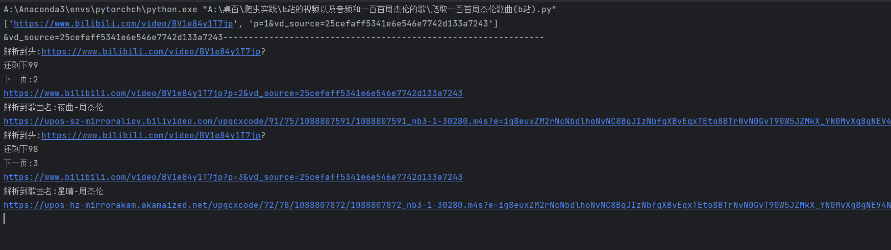
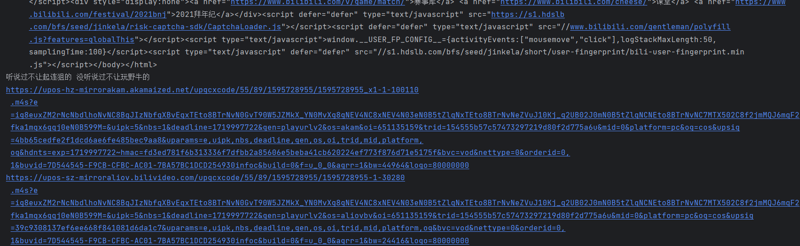
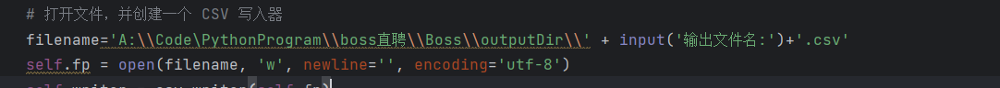
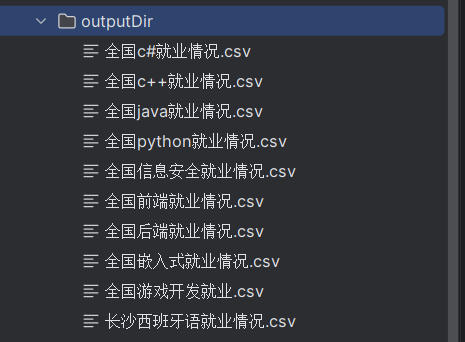
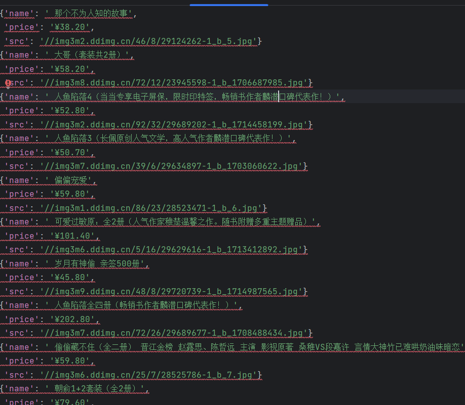
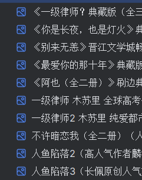

# 一些爬虫小案例(BOSS直聘框架爬取案例)

## 爬取前准备

安装环境

 [requirements.txt](requirements.txt) 

1. 打开命令行或终端。
2. 确保你已经激活了你的Python虚拟环境（如果你在使用虚拟环境的话）。例如，如果你使用的是Anaconda，你可以用以下命令激活你的虚拟环境：

```shell
conda activate your_environment_name
```

1. 使用 `pip` 安装 `requirements.txt` 文件中的依赖项：

```shell
pip install -r requirements.txt
```

**由于本人的环境有点乱可以自己进行选择性配置仅供参考!!!**

## 1. b站的视频以及音频和一百首周杰伦的歌(非框架)

 [b站的视频以及音频和一百首周杰伦的歌](b站的视频以及音频和一百首周杰伦的歌) 

设计版权问题这里不提供下载周杰伦歌曲

### （1）一百首周杰伦歌曲运行情况



**注意没有全部爬取中间我让他停止了**


### （2）b站视频和音频下载情况




程序不涉及音频和视频的合成 有需要可以用python库进行合成具体教程可以看网上查查

## 2. boss直聘运行结果(框架)

 [boss直聘](boss直聘) 

爬行这个的时候要注意页面懒加载机制和cookie的识别

多次爬取可能会出现暂时不能爬取的结果(但是其实不翻墙的情况下能爬取很多次不会出现问题)

运行过程中要确保不能关闭界面不然会报错

本人代码里面有直接用绝对路径的字符串一定要改好后再使用（目前只找到这个在piplines文件里面）


**运行结果分析**



**重点！！！**

**反爬机制的破解**（下载中间件）

```python
import os

from scrapy import signals
from scrapy.http import HtmlResponse
from selenium import webdriver
from selenium.webdriver.common.by import By
from selenium.webdriver.support.ui import WebDriverWait
from selenium.webdriver.support import expected_conditions as EC
import time
import json
from .global_vars import *


class BossSpiderMiddleware:
    @classmethod
    def from_crawler(cls, crawler):
        s = cls()
        crawler.signals.connect(s.spider_opened, signal=signals.spider_opened)
        return s

    def process_spider_input(self, response, spider):
        return None

    def process_spider_output(self, response, result, spider):
        for i in result:
            yield i

    def process_spider_exception(self, response, exception, spider):
        pass

    def process_start_requests(self, start_requests, spider):
        for r in start_requests:
            yield r

    def spider_opened(self, spider):
        spider.logger.info("Spider opened: %s" % spider.name)


class SeleniumMiddleware:
    query = ""
    city_id = ""

    def __init__(self):
        self.cookie_file = 'boss_cookies.json'
        # 检查文件是否存在，如果不存在则创建一个空文件
        if not os.path.exists(self.cookie_file):
            with open(self.cookie_file, 'w') as f:
                pass
        self.getcookie('https://www.zhipin.com/web/geek/job-recommend', self.cookie_file)
        self.driver = webdriver.Chrome()

    def getcookie(self, url, cookies):
        driver = webdriver.Chrome()
        driver.get(url)
        time.sleep(6)
        dict_cookies = driver.get_cookies()
        json_cookies = json.dumps(dict_cookies)
        with open(cookies, "w") as fp:
            fp.write(json_cookies)
            print('Cookies保存成功！')
        driver.quit()

    def load_cookies(self):
        with open(self.cookie_file, "r") as fp:
            cookies = json.load(fp)
        for cookie in cookies:
            if 'domain' in cookie:
                del cookie['domain']
            self.driver.add_cookie(cookie)

    def process_request(self, request, spider):
        try:
            if request.meta.get('first_request', True):
                qe = input('请搜索岗位和城市id(空格隔开):').split(' ')
                self.query = qe[0]
                self.city_id = qe[1]
                target_url = f"https://www.zhipin.com/web/geek/job?query={self.query}&city={self.city_id}&page=1"
                q: str = self.query
                c = self.city_id
                request.meta['first_request'] = False
            else:
                page = int(request.meta.get('page_number'))
                target_url = f"https://www.zhipin.com/web/geek/job?query={self.query}&city={self.city_id}&page={page}"
            print(f"Fetching URL: {target_url}")
            self.driver.get(target_url)
            self.load_cookies()
            self.driver.refresh()

            WebDriverWait(self.driver, 20).until(
                EC.presence_of_element_located((By.CLASS_NAME, "job-card-wrapper"))
            )

            data = self.driver.page_source
            return HtmlResponse(url=request.url, body=data, encoding='utf-8', request=request)
        except Exception as e:
            print(f"An error occurred: {e}")
            return HtmlResponse(url=request.url, status=500, request=request)

    def __del__(self):
        if self.driver:
            self.driver.quit()


```

## 3.其他用框架写的一些代码示例

### 爬取电影天堂

 [爬取电影天堂](爬取电影天堂) 

爬取电影的封面

没有写下载如要下载可以参考当当网的piplines中的代码进行改造加入本项目框架中的


### 爬取当当网

 [爬取当当网](爬取当当网) 



以及图片



爬取速度非常可观

**当当网的反爬破解(图片懒加载)**

```python
#此处省略其他代码
for li in li_list:
    src = li.xpath('.//img/@data-original').extract_first()
    # 第一张的src是没问题的其他的是有问题的
    if src:
        src = src
    else:
        src = li.xpath('.//img/@src').extract_first()
    name = li.xpath('.//img/@alt').extract_first()
    price = li.xpath('.//p[@class="price"]/span[1]/text()').extract_first()
    book = ScrapyDangdangItem(src=src,name=name,price=price)
    # 给管道
    yield book
#此处省略其他代码
```

