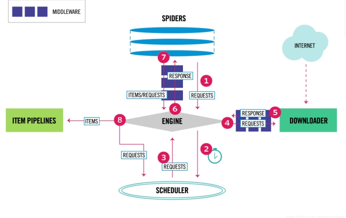
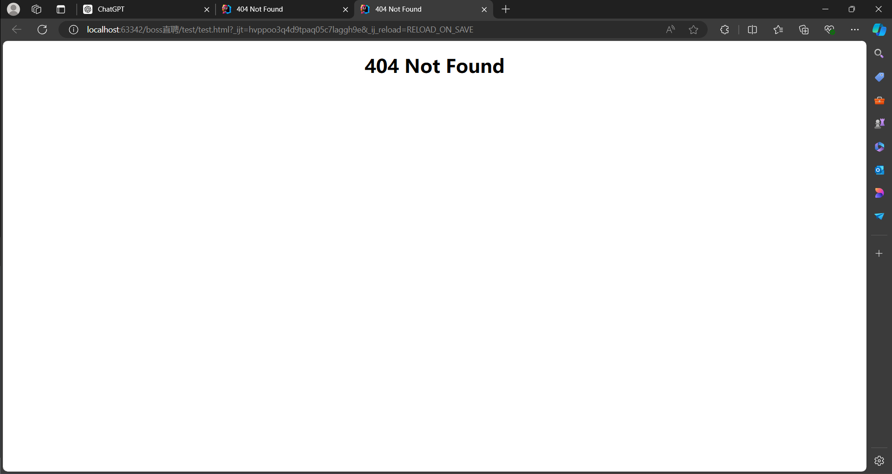
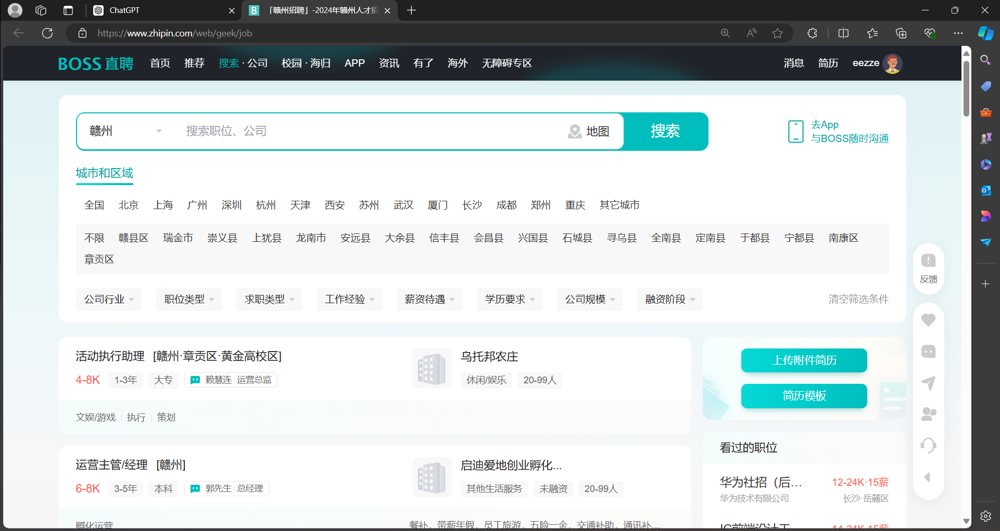

# SCrapy框架实现对BOSS直聘的爬取

## 对SCrapy框架的一个简单认识



### Scrapy 组件的作用

1. **Engine（引擎）**：负责控制系统所有组件之间的数据流，并在发生某些操作时触发事件。它是整个爬虫的核心。

2. **Scheduler（调度器）**：接收引擎的请求，对请求去重并放入队列中。当引擎请求新的请求时，将队列中的请求按顺序返回给引擎。

3. **Downloader（下载器）**：负责获取网页数据并将其返回给引擎，引擎再将数据传给 Spiders（爬虫）。

4. **Spiders（爬虫）**：解析响应，从中提取出 Items（项目）和新的 Requests（请求）。

5. **Item Pipeline（项目管道）**：处理爬虫提取的项目，包括清理、验证和存储项目。

6. **Downloader middlewares（下载器中间件）**：处理从引擎到下载器的请求和从下载器到引擎的响应，用于在这些过程中修改或替换请求和响应。

7. **Spider middlewares（爬虫中间件）**：处理爬虫的输入（响应）和输出（项目和请求），可以对这些数据进行修改、添加或删除。

### Scrapy 数据流

1. **初始请求**：
   - Scrapy 会实例化一个 Crawler 对象，在该对象中创建 Spider 对象和 Engine 对象。
   - 通过 Engine 对象打开 Spider，并生成第一个 request（请求）。

2. **请求处理流程**：
   - **步骤 1**：Engine 从 Spiders 获取初始请求。
   - **步骤 2**：Engine 把请求给调度器，并询问下一次请求。
   - **步骤 3**：Scheduler 对 URL 去重，放到队列中等待，并把下一个 request 返回给 Engine。
   - **步骤 4**：Engine 把从调度器返回的 request 经过下载中间件交给下载器。
   - **步骤 5**：Downloader 下载页面后生成一个 Response（响应），并通过下载器中间件将其发送到 Engine。
   - **步骤 6**：Engine 接收响应，并通过爬虫中间件将其发送到爬虫进行处理。
   - **步骤 7**：爬虫接收到响应，解析处理响应，提取出 Items 和 新的 Requests，再通过爬虫中间件提交给 Engine。
   - **步骤 8**：Engine 把接收到的 Items 提交给 Item Pipeline，把接收到的 Requests 提交给调度器。

3. **重复过程**：
   - 重复上述步骤，直到 Scheduler 中没有请求为止。

拿到一个网站爬取需求首先需要进行分析网站的反爬措施，再根据反爬漏洞想到对应的解决方法

## 1. 测试反爬

```python
import time
from random import randint, choice
import requests

url = 'https://ja.58.com/job.shtml?utm_source=sem-baidu-pc&spm=u-2few7p4vh988mb62t1.2few8w827wgt4eurg.kd_201345177084.cr_43861026238.ac_20304970.cd_11302497077865040299'

user_agents = [
    'Mozilla/5.0 (Windows NT 10.0; Win64; x64) AppleWebKit/537.36 (KHTML, like Gecko) Chrome/125.0.0.0 Safari/537.36 Edg/125.0.0.0',
    'Mozilla/5.0 (Windows NT 10.0; Win64; x64) AppleWebKit/537.36 (KHTML, like Gecko) Chrome/110.0.0.0 Safari/537.36 Edg/110.0.0.0',
    'Mozilla/5.0 (Windows NT 10.0; Win64; x64) AppleWebKit/537.36 (KHTML, like Gecko) Chrome/100.0.0.0 Safari/537.36 Edg/100.0.0.0'
]

headers = {
    'User-Agent': choice(user_agents)
}

response = requests.get(url=url, headers=headers)

with open('test.html', 'w', encoding='utf-8') as f:
    f.write(response.text)

# 随机延时 1 到 5 秒
time.sleep(randint(1, 5))

```



可知直接爬取会被屏蔽，但是正常打开没有问题



**因此想到用来selenium库来进行打开操作同时获取cookie保存**

```python
 def getcookie(self, url, cookies):
        driver = webdriver.Chrome()
        driver.get(url)
        time.sleep(6)
        dict_cookies = driver.get_cookies()
        json_cookies = json.dumps(dict_cookies)
        with open(cookies, "w") as fp:
            fp.write(json_cookies)
            print('Cookies保存成功！')
        driver.quit()
def load_cookies(self):
        with open(self.cookie_file, "r") as fp:
            cookies = json.load(fp)
        for cookie in cookies:
            if 'domain' in cookie:
                del cookie['domain']
            self.driver.add_cookie(cookie)
```

## 2. 定义一个下载中间件类,截取spiders的请求（中间件直接截取请求，并且返回给Spider进行数据解析）

```python
class SeleniumMiddleware:
    query = ""
    city_id = ""

    def __init__(self):
        self.cookie_file = 'boss_cookies.json'
        # 检查文件是否存在，如果不存在则创建一个空文件
        if not os.path.exists(self.cookie_file):
            with open(self.cookie_file, 'w') as f:
                pass
        self.getcookie('https://www.zhipin.com/web/geek/job-recommend', self.cookie_file)
        self.driver = webdriver.Chrome()

    def getcookie(self, url, cookies):
		#此处省略
    def load_cookies(self):
		#此处省略

    def process_request(self, request, spider):
        try:
            if request.meta.get('first_request', True):
                qe = input('请搜索岗位和城市id(空格隔开):').split(' ')
                self.query = qe[0]
                self.city_id = qe[1]
                target_url = f"https://www.zhipin.com/web/geek/job?query={self.query}&city={self.city_id}&page=1"
                q: str = self.query
                c = self.city_id
                request.meta['first_request'] = False
            else:
                page = int(request.meta.get('page_number'))
                target_url = f"https://www.zhipin.com/web/geek/job?query={self.query}&city={self.city_id}&page={page}"
            print(f"Fetching URL: {target_url}")
            self.driver.get(target_url)
            self.load_cookies()
            self.driver.refresh()

            WebDriverWait(self.driver, 20).until(
                EC.presence_of_element_located((By.CLASS_NAME, "job-card-wrapper"))
            )

            data = self.driver.page_source
            return HtmlResponse(url=request.url, body=data, encoding='utf-8', request=request)
        except Exception as e:
            print(f"An error occurred: {e}")
            return HtmlResponse(url=request.url, status=500, request=request)

    def __del__(self):
        if self.driver:
            self.driver.quit()

```

**请求代码**

```python
  WebDriverWait(self.driver, 20).until(
                EC.presence_of_element_located((By.CLASS_NAME, "job-card-wrapper"))
            )

```

因为boss直聘具有反爬操作，很多时候能够检测出来不是正常用户，需要用该方法反复进行请求操作直到html页面中能够获取我们想要的标签内容(这个标签下的很多数据都是我们需要进行爬取操作的数据)

## 数据解析操作

使用Xpath来进行，同时对空数据进行处理

```python
import scrapy
from ..items import BossItem


class BossSpider(scrapy.Spider):
    name = "boss"
    allowed_domains = ["www.zhipin.com"]
    start_urls = ["https://www.zhipin.com/"]
    page = 1

    def parse(self, response):
        with open('test.html', 'w', encoding='utf-8') as f:
            f.write(response.text)

        # 改进的XPath表达式
        li_list = response.xpath('//li[@class="job-card-wrapper"]')
        print(f"Number of items found: {len(li_list)}===============================================")

        for li in li_list:
            title = li.xpath(".//span[@class='job-name']/text()").extract_first() or ''
            salary = li.xpath(".//span[@class='salary']/text()").extract_first() or ''
            area = li.xpath(".//span[@class='job-area']/text()").extract_first() or ''

            # 确保提取job_lable_list的正确性
            job_lable_list = li.xpath(".//ul[@class='tag-list']//text()").extract()
            if len(job_lable_list) >= 2:
                experience = job_lable_list[0] or ''
                education = job_lable_list[1] or ''
            else:
                experience = ''
                education = ''

            company = li.xpath(".//h3[@class='company-name']/a/text()").extract_first() or ''

            # 确保提取company_message的正确性
            company_message = li.xpath(".//ul[@class='company-tag-list']//text()").extract()
            company_type = company_message[0] if company_message else ''

            # 提取boon字段
            boon = li.xpath('.//div[@class="job_card_footer"]//div[@class="info-desc"]/text()').extract()
            boon = boon[0] if boon else None
            # 技能
            skill_list = li.xpath(
                ".//div[@class='job-card-footer clearfix']//ul[@class='tag-list']/li/text()").extract() or []
            skill = "|".join(skill_list)
            # 创建BossItem对象并传递数据
            book = BossItem(
                title=title,
                address=area,
                salary=salary,
                experience=experience,
                education=education,
                company=company,
                companyType=company_type,
                skill_list=skill,
            )
            yield book

        if self.page < 10:
            self.page += 1
            next_url = f"https://www.zhipin.com/web/geek/job?query=java&city=101210100&page={self.page}"
            yield scrapy.Request(
                url=next_url,
                callback=self.parse,
                meta={'page_number': self.page, 'first_request': False}
            )

```

**spider/boss.py中代码的注意事项**


```python
        if self.page < 10:
            self.page += 1
            next_url = f"https://www.zhipin.com/web/geek/job?query=java&city=101210100&page={self.page}"
            yield scrapy.Request(
                url=next_url,
                callback=self.parse,
                meta={'page_number': self.page, 'first_request': False}
            )
```

注意:此代码next_url传过去不会真正的被下载器中间件处理，而是为了防止不报错而进行的(不知道哪错了)

**中间件部分代码**

```python
 if request.meta.get('first_request', True):
                qe = input('请搜索岗位和城市id(空格隔开):').split(' ')
                self.query = qe[0]
                self.city_id = qe[1]
                target_url = f"https://www.zhipin.com/web/geek/job?query={self.query}&city={self.city_id}&page=1"
                q: str = self.query
                c = self.city_id
                request.meta['first_request'] = False
            else:
                page = int(request.meta.get('page_number'))
                target_url = f"https://www.zhipin.com/web/geek/job?query={self.query}&city={self.city_id}&page={page}"
```

由于csdn下载代码需要开启vip具体代码实现可以访问我的github:

[2240774934/Crawler_instances: 最新BOSS直聘爬取以及其他常见网站爬取 (github.com)](https://github.com/2240774934/Crawler_instances)

